# real time bus tracking system
In this project, we will transfer the location information coming with the GPS module to another LORA module with the LORA module and send it to the web server with the Wi-Fi module and track the location information of the bus in real time.

## Modules used in the project:
- [e32-433t20d lora](https://shop.fixaj.com/e32-433t20d-lora-modulu-e32-433t20dc-sx1278-433-mhz)
- [4.0dBi SMA 433 MHz Anten](https://shop.fixaj.com/40dbi-sma-433-mhz-anten-tx433-jkd-20p)
- [gy-neo6mv2 gps](https://www.robotistan.com/gy-neo6mv2-gps-modulu-ucus-kontrol-sistem-gpsi)
- [nodemcu v3 esp8266 esp 12e](https://www.robotistan.com/nodemcu-lolin-esp8266-gelistirme-karti-usb-chip-ch340)

create the transmitter and receiver circuits
# transmitter circuit
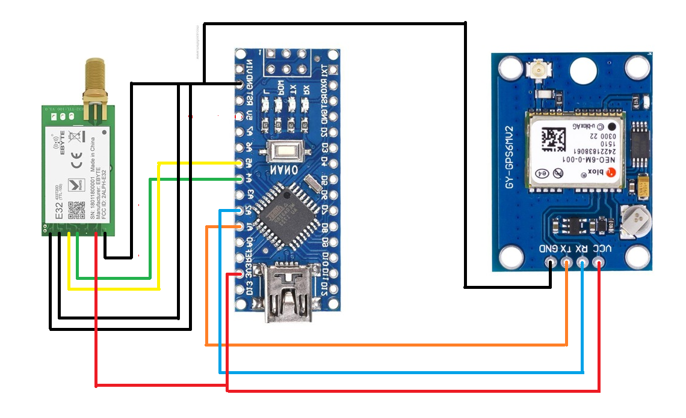

# receiver circuit
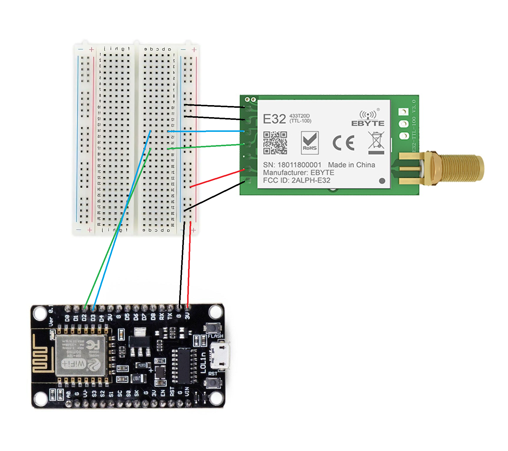

upload receiver and transmitter code according to "receiverArduinoCode" and "transmitterArduinoCode"

create sql table to save longitude and latitude values coming from the gps module

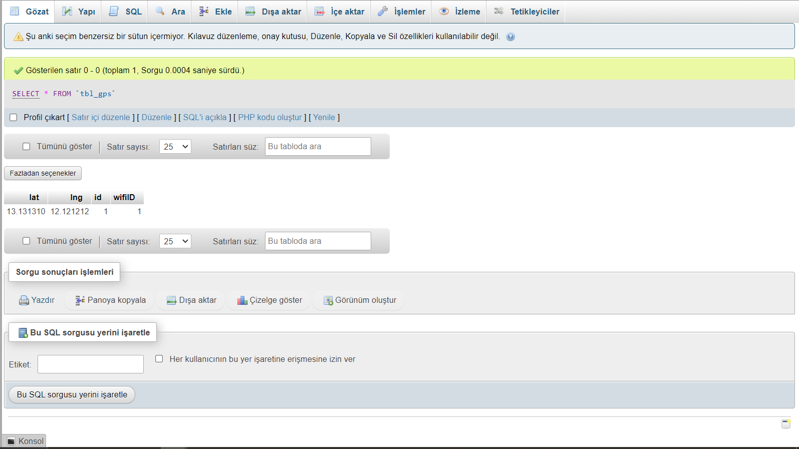

connect your sql table  with php

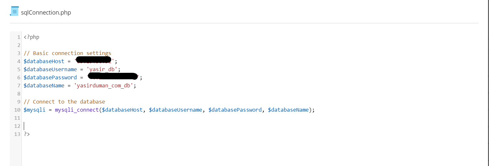

handle post request with php coming from the receiver circuit

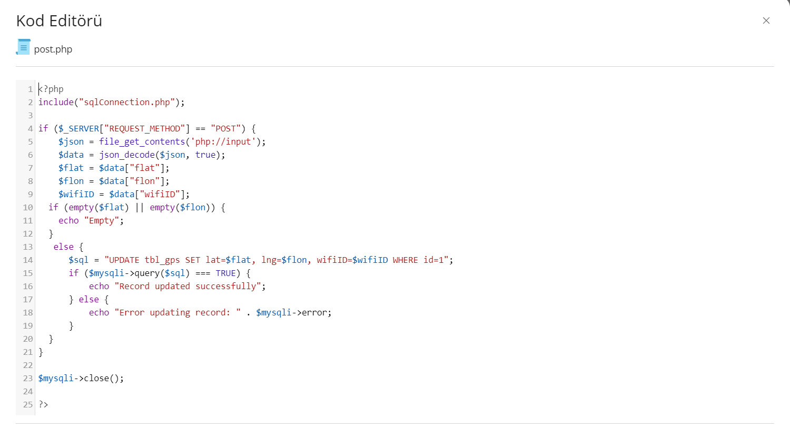

create API for coming location information

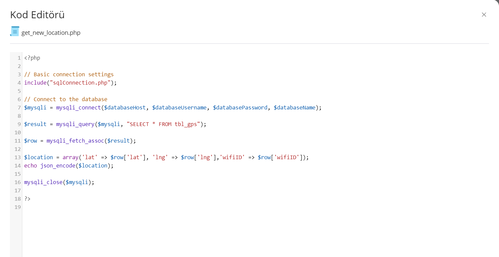

location informations can be showed like that 

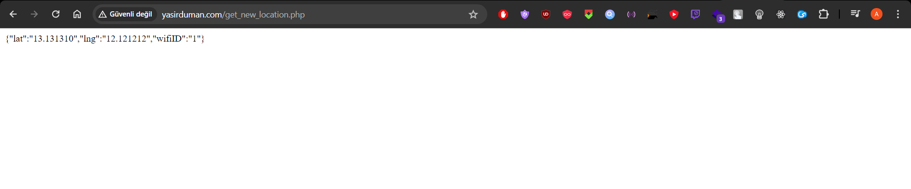

get API Key for showing the point on map from Google Cloud

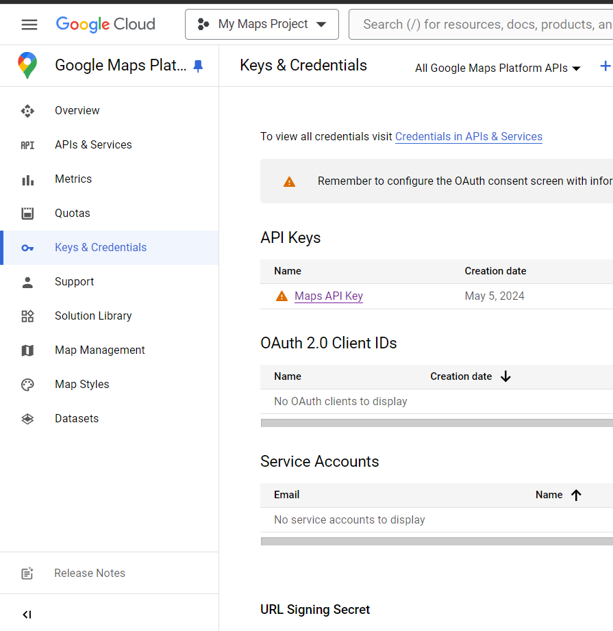

add the key on  html src tag

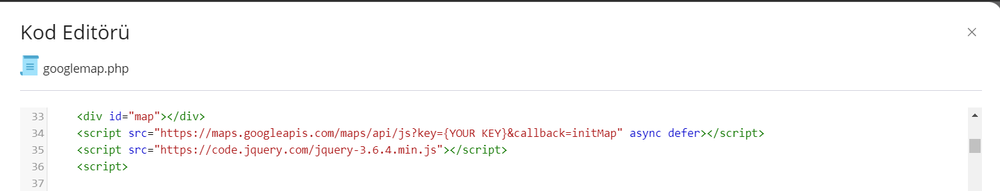

fetch location using jQuery

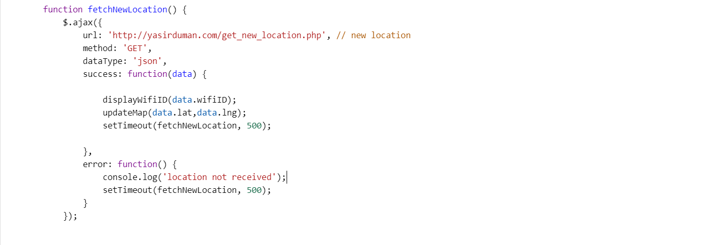

initialize map based on your preference

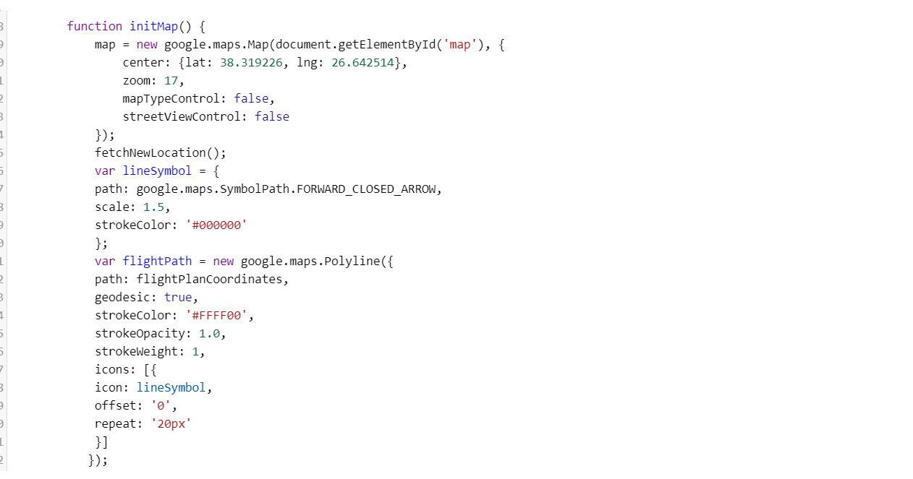

